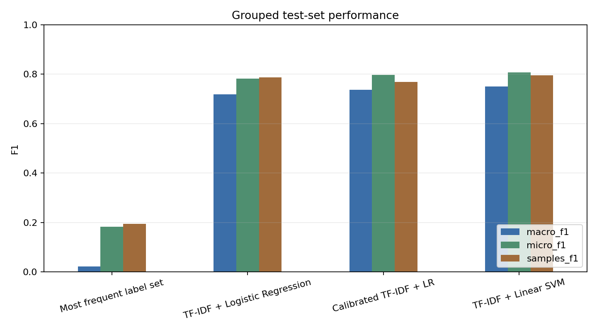

# Cyber Threat Intelligence ATT&CK Triage

[](https://github.com/SahilBh01r1769/cyberattack-tactics-triage/actions/workflows/tests.yml)

An NLP project that maps short cyber-threat descriptions to one or more Enterprise MITRE ATT&CK tactics. It trains on official ATT&CK procedure examples—no LLM or external classification API is used.

The project is both an ML investigation and a small triage aid. It is not intended to replace analyst judgment.

## What I built

I built the dataset from official ATT&CK procedure examples, created source-grouped splits, trained and compared multilabel classifiers, separated probability calibration from threshold selection, and packaged the selected model into a Streamlit workbench. The workbench also exposes local feature contributions and routes uncertain cases to manual review.

## What it predicts

The target is **multilabel tactic classification**, not fine-grained technique identification. A single description can therefore map to several tactics when the linked ATT&CK technique spans more than one phase. For example, a scheduled task that launches PowerShell may support Execution, Persistence and Privilege Escalation.

Predictions include per-tactic probabilities and a separate routing decision. If the strongest predicted tactic does not meet the selected routing threshold, the workbench returns `analyst_review` instead of forcing an automatic decision.

For example, a description such as “The adversary executed a PowerShell command through a scheduled task” can produce Execution, Persistence and Privilege Escalation predictions, their probabilities, and a decision on whether the result is confident enough to route automatically.

## Try the workbench

The Streamlit workbench supports:

- individual threat triage with an interactive ATT&CK tactic map;
- configurable confidence-aware analyst routing;
- local TF-IDF feature contributions for the deployed classifier;
- CSV batch classification and exportable review queues;
- direct access to model, calibration and stress-test evidence.

```bash
git clone https://github.com/SahilBh01r1769/cyberattack-tactics-triage.git
cd cyberattack-tactics-triage
python -m venv .venv
source .venv/bin/activate  # Windows: .venv\Scripts\activate
python -m pip install -r requirements-app.txt
streamlit run app.py
```

The repository includes a compressed, checksum-tested classical model, so the interface runs without retraining.
For a short tour of every interaction and its expected result, use the [dashboard test plan](docs/dashboard_test_plan.md).

CLI inference is also available:

```bash
python -m src.inference.predict --text "The adversary executed a PowerShell command."
```

## Results

Results use a source-grouped holdout: an actor, malware family, tool or campaign cannot appear in more than one partition. Eight cross-partition near-duplicate records are explicitly excluded.

| Model | Macro F1 | Micro F1 | Samples F1 | Exact match |
|---|---:|---:|---:|---:|
| Most-frequent label set | 0.022 | 0.183 | 0.195 | 0.186 |
| TF-IDF + Logistic Regression | 0.742 | 0.802 | **0.809** | 0.663 |
| Calibrated TF-IDF + LR | 0.752 | 0.807 | 0.789 | 0.685 |
| TF-IDF + Linear SVM | **0.773** | **0.826** | 0.807 | **0.720** |

Linear SVM is the strongest verified model on the cleaned split. A previous DistilBERT run reached 0.779 macro F1, but it predates the near-duplicate cleanup and is kept as historical evidence until rerun rather than mixed into the current comparison.

I initially expected the transformer to provide the clearest improvement. Instead, the classical SVM remained strongest on the verified, cleaned evaluation. Because these descriptions are short and terminology-heavy, I deployed the simpler verified model rather than selecting the most complex model by default.

Macro F1 is the primary selection metric because it gives small tactics meaningful weight. Micro F1 is included to show aggregate label performance, while exact match requires the complete predicted tactic set to match the reference labels. The results show that the linear SVM remains a strong model for this relatively concise, terminology-heavy text.



### Confidence-aware routing

Platt calibrators and label thresholds are now fitted on separate, source-disjoint halves of the validation partition. Calibration reduces macro Brier score from 0.0266 to 0.0213 and expected calibration error from 0.0416 to 0.0085.

Routing confidence is the highest calibrated probability among the predicted tactics—or the strongest candidate when no label passes its own threshold. Raising the routing threshold improves performance on accepted cases while sending more examples to manual review.

| Routing threshold | Auto-route coverage | Micro F1 on accepted cases | Samples F1 on accepted cases |
|---:|---:|---:|---:|
| 0.50 | 86.8% | 0.854 | 0.870 |
| 0.70 | 78.0% | 0.878 | 0.897 |
| 0.90 | 59.4% | 0.913 | 0.928 |

### Unseen-technique stress test

A secondary test trains the selected SVM on 452 techniques and evaluates it on 114 entirely unseen techniques. Macro F1 falls to **0.516** with zero technique overlap. This is intentionally not presented as a competing benchmark: it shows that unfamiliar behaviors remain substantially harder than unfamiliar actors or tools.

## How the project changed

- A random split looked stronger, but allowed the same actors and tools to appear across partitions.
- I replaced it with a source-grouped split and later removed eight audited cross-partition near-duplicates.
- I separated calibration fitting from threshold selection to avoid using the same validation examples for both decisions.
- I added a technique-held-out stress test after realizing that unseen sources and unseen behaviors answer different questions.

## Data and methodology

The dataset builder reads MITRE's official [Enterprise ATT&CK STIX data](https://github.com/mitre-attack/attack-stix-data), resolves procedure-to-technique relationships and technique-to-tactic phases, cleans markup, removes exact duplicates and retains source provenance.

- 16,955 usable procedure examples, 611 techniques and 15 tactics
- 2,267 multilabel examples (13.4%)
- 11,006 train / 2,550 validation / 3,391 test / 8 excluded near-duplicates
- zero exact-text, source or audited near-duplicate overlap across active partitions
- model progression: trivial baseline → Logistic Regression → Linear SVM → DistilBERT

The grouped-source split is more conservative than a random sentence split: the random comparison shared 882 source entities across train and test. Techniques are allowed to cross the primary split because the main question is whether the model generalizes to unseen threat actors and software describing known behavior categories. The separate technique-held-out experiment tests the harder alternative.

Class imbalance is handled through balanced class weights rather than generated or oversampled text. The smallest tactic, Reconnaissance, has only 29 positive test examples, so its per-label result should be treated as less stable than the major classes.

Detailed split diagnostics, calibration tables, per-label results, feature weights and error exports are committed under `artifacts/metrics/`. See [experiment notes](docs/experiment_notes.md) for decisions and observed errors.

## Repository guide

- `src/data/` builds the ATT&CK-derived dataset and reproducible splits.
- `src/models/` trains classical models, calibrates confidence and fine-tunes DistilBERT.
- `src/evaluation/` produces metrics, figures, stress tests and error exports.
- `src/inference/` contains the reusable predictor and command-line interface.
- `artifacts/` contains small committed evidence and the compressed demo model.
- `tests/` uses local fixtures; unit tests never download the full ATT&CK dataset.

## Reproduce the experiment

Python 3.10 or newer is required.

```bash
python -m pip install -r requirements-dev.txt
python -m src.data.build_dataset
python -m src.data.split
python -m src.models.train_classical
python -m src.models.calibrate
python -m src.evaluation.evaluate
python -m src.evaluation.error_analysis
python -m src.evaluation.technique_holdout
python -m src.models.package_inference
python -m pytest
```

To rerun DistilBERT, use `python -m src.models.train_transformer` or open [`notebooks/02_train_transformer_colab.ipynb`](notebooks/02_train_transformer_colab.ipynb) in Colab. The script uses the same persisted partitions, class-weighted loss, early stopping and validation-only threshold selection.
