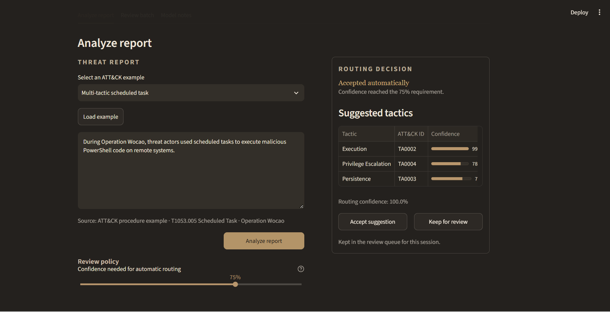
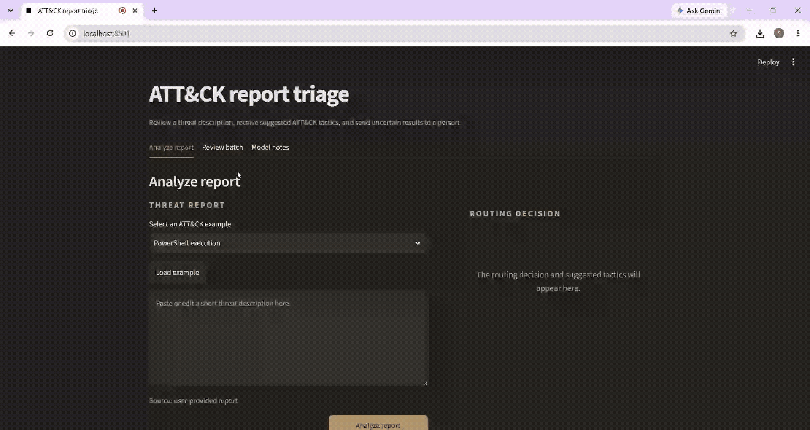
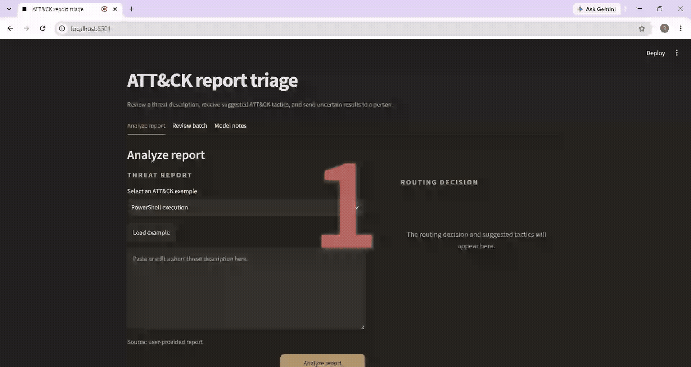

# Cyber Threat Intelligence ATT&CK Triage

[](https://github.com/SahilBh01r1769/cyberattack-tactics-triage/actions/workflows/tests.yml)

This project uses NLP to map short cyber-threat descriptions to one or more **MITRE ATT&CK tactics** such as Execution, Persistence or Credential Access.

The training data comes from official Enterprise ATT&CK procedure examples. No LLM or external classification API is used for prediction.

Given a short report describing what an attacker did, the model predicts the broad ATT&CK phases it belongs to and shows when the result is uncertain enough that a person should review it.

## What the project does

A single description can belong to more than one tactic. For example, a scheduled task that launches PowerShell may be related to Execution, Persistence and Privilege Escalation at the same time.

The project therefore treats this as **multilabel text classification** rather than choosing only one class.

```text
MITRE ATT&CK procedure examples
        ↓
clean and split the text data
        ↓
TF-IDF text features
        ↓
multilabel classifiers
        ↓
predicted tactics + probabilities
        ↓
auto-route or send for analyst review
```

The Streamlit app supports individual reports, CSV batches, confidence-based review routing and simple feature-level explanations for the deployed classical model.



```bash
git clone https://github.com/SahilBh01r1769/cyberattack-tactics-triage.git
cd cyberattack-tactics-triage
python -m venv .venv
source .venv/bin/activate  # Windows: .venv\Scripts\activate
python -m pip install -r requirements-app.txt
streamlit run app.py
```

A packaged classical model is included, so the interface can run without retraining.

### Batch review

The same classifier can process a CSV of reports and produce a review queue.



## Models and results

I compared a trivial baseline with TF-IDF based Logistic Regression and Linear SVM models. A DistilBERT experiment is also included, but its saved result predates the final near-duplicate cleanup, so I do not mix it into the current verified comparison.

| Model | Macro F1 | Micro F1 | Samples F1 | Exact match |
|---|---:|---:|---:|---:|
| Most-frequent label set | 0.022 | 0.183 | 0.195 | 0.186 |
| TF-IDF + Logistic Regression | 0.742 | 0.802 | **0.809** | 0.663 |
| Calibrated TF-IDF + LR | 0.752 | 0.807 | 0.789 | 0.685 |
| TF-IDF + Linear SVM | **0.773** | **0.826** | 0.807 | **0.720** |

The Linear SVM is the strongest verified model on the cleaned split.


One important part of the evaluation is the way the data is split. ATT&CK contains many examples tied to the same malware, actor, tool or campaign. A random sentence split can place closely related material in both training and testing and make the result look better than it really is.

For the main experiment, source entities are kept on only one side of the split. Eight audited near-duplicate records that still crossed partitions are excluded as well.

## Confidence and manual review

The app uses calibrated probabilities to decide whether a prediction is confident enough to route automatically or should be left for manual review. A higher threshold sends more cases to review.



## A harder test

The main split asks whether the model can handle **new actors and tools describing known ATT&CK behavior**.

I also ran a separate test where the evaluation set contains techniques that never appear in training. Performance drops substantially: macro F1 falls to **0.516**. That test is useful because it shows a real limitation of the system—recognizing completely unfamiliar behavior is much harder than recognizing familiar behavior described by a new source.

## How the project changed

The first version used a random split and produced stronger-looking results. After checking the data more closely, I found that the same actors and tools could appear on both sides of the split, so I replaced it with the grouped version.

Later I removed eight cross-partition near-duplicates, separated confidence calibration from threshold selection, and added the unseen-technique test. I also expected the transformer model to clearly outperform the classical models, but the verified SVM remained very competitive on these short, terminology-heavy descriptions.

## Data

The dataset builder reads MITRE's official [Enterprise ATT&CK STIX data](https://github.com/mitre-attack/attack-stix-data), resolves procedure-to-technique relationships and converts technique phases into tactic labels.

Current cleaned dataset:

- 16,955 usable procedure examples
- 611 techniques
- 15 tactics
- 2,267 multilabel examples
- 11,006 train / 2,550 validation / 3,391 test
- 8 excluded near-duplicates

Class imbalance is handled with class weights rather than generated training text.

## Repository guide

```text
src/data/        dataset building and splits
src/models/      model training and calibration
src/evaluation/  metrics and stress tests
src/inference/   reusable prediction code
artifacts/       saved metrics, figures and packaged demo model
tests/           local unit tests
```

For the main experiment:

```bash
python -m pip install -r requirements-dev.txt
python -m src.data.build_dataset
python -m src.data.split
python -m src.models.train_classical
python -m src.models.calibrate
python -m src.evaluation.evaluate
python -m pytest
```

## Scope

This is a tactic-level triage aid, not an automated threat-analysis system. It predicts broad ATT&CK tactics from short procedure descriptions and is designed to expose uncertainty rather than replace analyst judgment.
