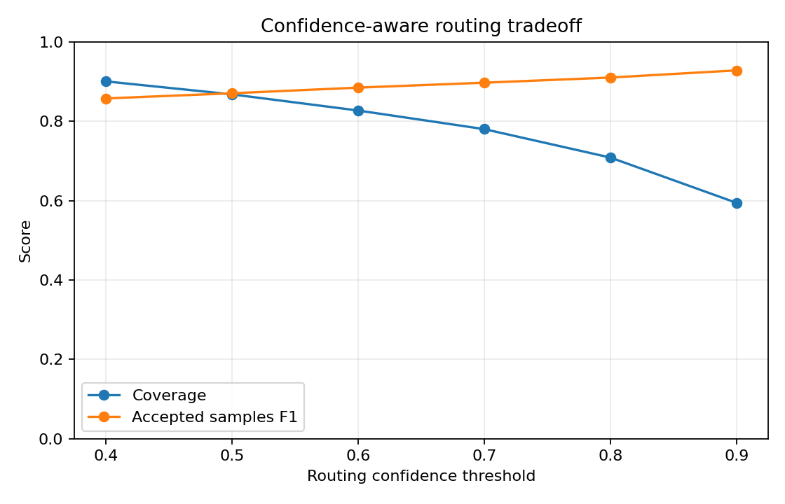
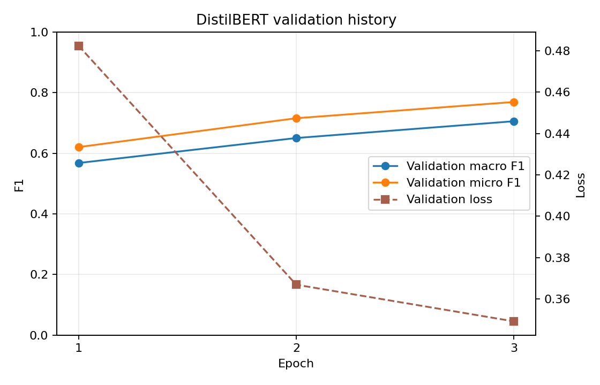

# Cyber Threat Intelligence ATT&CK Triage

[](https://github.com/SahilBh01r1769/cyber/actions/workflows/tests.yml)

An NLP experiment that maps short cyber-threat procedure descriptions to one or more Enterprise MITRE ATT&CK tactics. The project trains its own classifiers on ATT&CK procedure examples; it does not use an LLM or external classification API.

This is a triage aid and ML investigation, not an autonomous SOC or incident-response system.

## Current experiment

The dataset builder reads MITRE's official [Enterprise ATT&CK STIX bundle](https://github.com/mitre-attack/attack-stix-data), resolves `uses` relationships to techniques and tactics, cleans citation markup, removes duplicate text, and retains source provenance.

- 16,955 procedure examples
- 611 techniques and 15 tactics
- 2,267 multilabel examples (13.4%)
- 11,013 / 2,551 / 3,391 train, validation and test examples
- split by source group, malware, tool or campaign; no source or exact text crosses partitions
- 8 cross-partition pairs exceeded 0.92 word n-gram cosine similarity and remain documented for follow-up
- source STIX SHA-256 recorded in `artifacts/metrics/dataset_statistics.json`

A naive random test split shared 882 sources with its training partition. The reported results use the stricter source-grouped test set.

| Model | Macro F1 | Micro F1 | Samples F1 | Exact label-set accuracy |
|---|---:|---:|---:|---:|
| Most frequent label set | 0.022 | 0.183 | 0.195 | 0.186 |
| TF-IDF + Logistic Regression | 0.741 | 0.801 | 0.808 | 0.664 |
| Calibrated TF-IDF + Logistic Regression | 0.754 | 0.812 | 0.790 | 0.696 |
| TF-IDF + Linear SVM | 0.772 | **0.826** | 0.807 | 0.720 |
| DistilBERT, validation-tuned thresholds | **0.779** | 0.822 | **0.819** | **0.753** |

DistilBERT has the best macro, samples and exact label-set scores, but the gain over Linear SVM is small. SVM retains slightly higher micro F1 and lower Hamming loss, making it a strong lightweight alternative. Calibrated logistic regression remains the confidence-aware inference model because its probabilities were evaluated explicitly.


## Confidence-aware routing

Per-label Platt scaling is fitted only on the validation partition. On the grouped test set it reduced macro Brier score from 0.0265 to 0.0213 and expected calibration error from 0.0416 to 0.0077.

| Routing threshold | Auto-route coverage | Micro F1 on accepted examples | Samples F1 on accepted examples |
|---:|---:|---:|---:|
| 0.50 | 86.7% | 0.860 | 0.876 |
| 0.70 | 77.6% | 0.884 | 0.901 |
| 0.90 | 58.8% | 0.919 | 0.933 |

These values describe this ATT&CK-derived test set, not live SOC traffic.



## Reproduce

Python 3.10 or newer is required.

```bash
python -m venv .venv
source .venv/bin/activate
# Windows PowerShell: .venv\Scripts\Activate.ps1
python -m pip install -r requirements-dev.txt

python -m src.data.build_dataset
python -m src.data.split
python -m src.models.train_classical
python -m src.models.calibrate
python -m src.evaluation.evaluate
python -m src.evaluation.error_analysis
python -m pytest
```

Run inference with the bundled calibrated model:

```bash
python -m src.inference.predict --text "The adversary executed a PowerShell command."
```

The default 0.70 routing threshold is configurable with `--threshold`. Add `--json` for structured output.

## ATT&CK Triage Workbench

The Streamlit interface turns the experiment into a small analyst-facing product without hiding the model evidence. It includes:

- interactive multilabel triage with a configurable analyst-review threshold;
- an ATT&CK tactic map and local TF-IDF feature contributions;
- CSV batch classification and an exportable review queue;
- model comparison, calibration and transformer diagnostics.

Three included examples are copied directly from the processed ATT&CK records and retain their source provenance. Run the workbench locally:

```bash
python -m pip install -r requirements-app.txt
streamlit run app.py
```

The 4.2 MB inference model is a compressed copy of the calibrated Logistic Regression artifact. Regenerate and parity-check it after retraining with:

```bash
python -m src.models.package_inference
```

## Transformer path

`src/models/train_transformer.py` fine-tunes `distilbert-base-uncased` with class-weighted binary cross-entropy, early stopping and the same grouped partitions:

```bash
python -m src.models.train_transformer
```

For a GPU run, open [`notebooks/02_train_transformer_colab.ipynb`](notebooks/02_train_transformer_colab.ipynb) in Colab and run it top to bottom. It downloads a small evidence ZIP and can preserve the checkpoint in Google Drive. `--smoke-limit 128` provides a bounded flow check.

The recorded full run used a Tesla T4 for three epochs and took 106 seconds. A fixed 0.5 decision threshold reached only 0.695 macro F1 because positive-class weighting favored recall. Thresholds selected independently for each label on validation data raised grouped-test macro F1 to 0.779. Both results are retained to make the threshold sensitivity visible.



## Evidence

Small, reproducible evidence is committed under `artifacts/metrics/` and `artifacts/figures/`, including experiment tables, per-label metrics, calibration data, prediction exports, TF-IDF feature weights and misclassified examples. The compressed classical model used by the demo is committed and checksum-verified; training artifacts and transformer checkpoints remain ignored.

See [experiment notes](docs/experiment_notes.md) for dataset decisions and observed error patterns.
